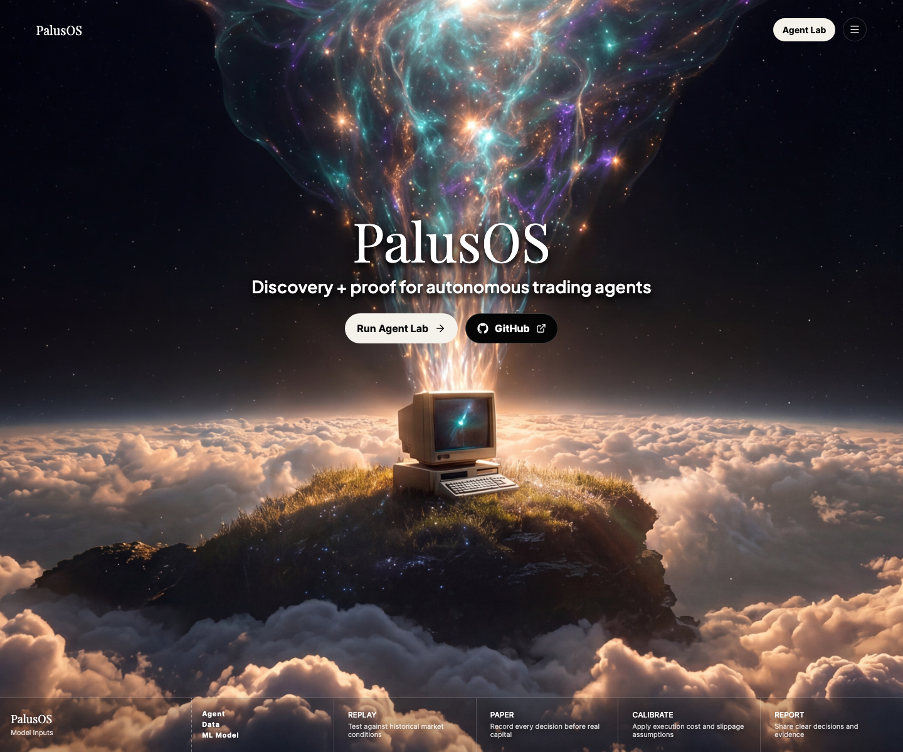
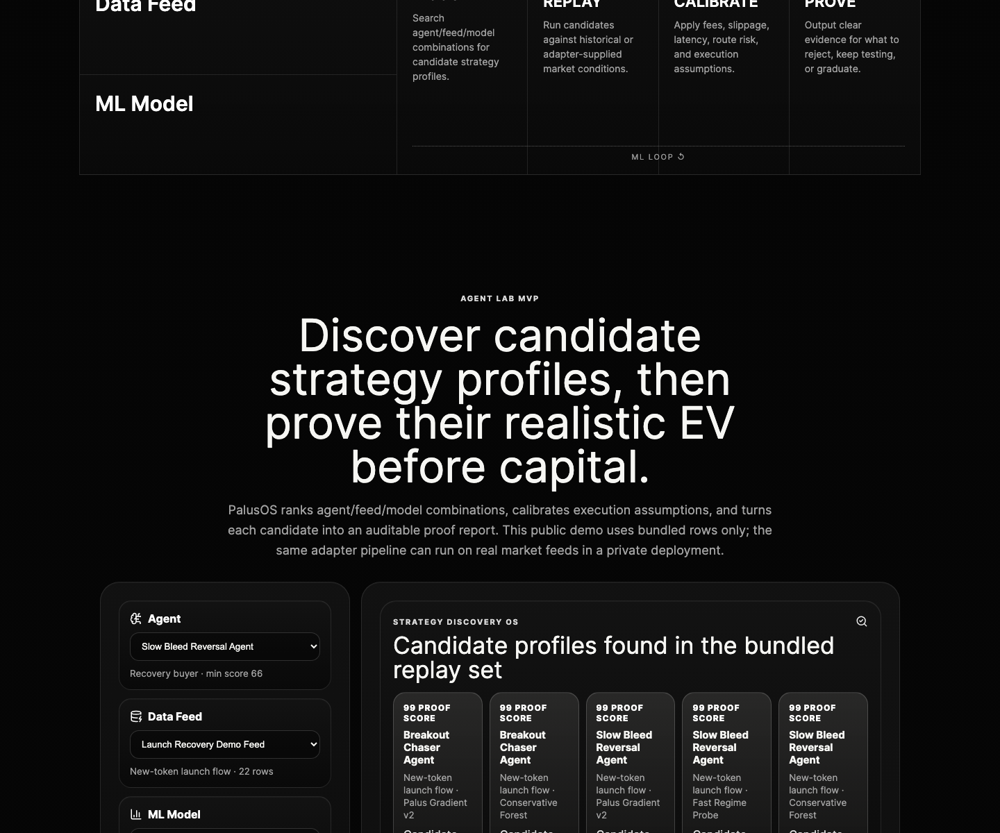
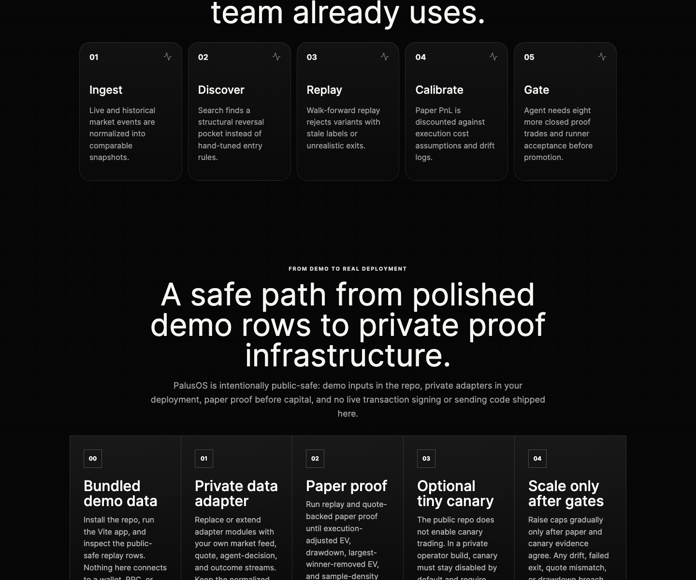

# PalusOS

**Discovery + proof for autonomous trading agents.**

PalusOS is the discovery and proof engine for autonomous trading agents. It searches for candidate trading profiles, tests them through replay and quote-backed paper trading, calibrates results against execution reality, and produces EV reports before capital is at risk.

## Why this exists

Trading agents are easy to launch and hard to trust. Backtests and paper PnL can look convincing until slippage, latency, fees, failed exits, adverse selection, and outlier dependence show up. PalusOS gives teams a repeatable way to discover candidates, punish fake signal, compare profiles, and decide what to reject, keep testing, or graduate carefully under limits.

## Demo data included

This repo ships with bundled demo data so you can run the full UI immediately. The architecture is data-adapter based: replace the demo rows with your own market feeds or agent decision logs, and the same discovery/evaluation/proof pipeline runs on those inputs.

## Screenshots







## What this repo contains

- polished landing page and demo UI;
- deterministic strategy discovery across bundled agent/feed/model combinations;
- modular architecture for market adapters, strategy runners, evaluation gates, and reports;
- demo agent evaluation data;
- tutorial and presentation outline;
- no secrets, private keys, `.env` files, or private databases.

## Demo flow

1. Discover candidate strategy profiles across agent, data-feed, and ML-model combinations.
2. Choose a candidate trading agent/profile.
3. Compare raw replay results against execution-adjusted assumptions.
4. Review robustness gates such as outlier-removed EV, largest-winner-removed EV, and drawdown limits.
5. Get a final verdict: **Reject**, **Keep Testing**, or **Promote / Canary Eligible** under explicit limits.

## Live `/demo` route

The app also ships a proper `/demo` page. It uses the same PalusOS UI language, lets the user select the trading profile and ML model, and calls server-side endpoints for live inputs:

- `api/live-feed.ts` reads recent Pump/PumpSwap signatures from one Solana JSON-RPC endpoint (`PALUS_RPC_URL`, `PALUS_HELIUS_RPC_URL`, `HELIUS_RPC_URL`, or `FLUX_RPC_URL`).
- The same server endpoint can call Jupiter quotes with `PALUS_JUPITER_API_KEY` to compute paper-only round-trip quote observations.
- The client never receives RPC URLs, Jupiter keys, wallet material, transaction payloads, or signing capability.
- If env is unavailable or an upstream request fails, `/demo` falls back to bundled public-safe demo rows.

## Quick start

```bash
npm install
npm run dev
```

Open the local Vite URL printed in the terminal. The first-run experience is the polished PalusOS website and Agent Lab UI, not a CLI-only workflow. Visit `/demo` for the live-paper demo route; without server env it intentionally shows the demo fallback.

## Build

```bash
npm run build
```

## Project structure

```text
.env.example                      public-safe private deployment checklist; no secrets
src/data/agentLabData.ts           bundled demo feeds, agents, and models
src/data/demoAgents.ts             demo agent evidence
src/modules/adapters.ts            market and strategy adapter shapes
src/modules/evaluationEngine.ts    discovery, EV calibration, gates, and verdicts
src/modules/livePaper.ts           shared live-feed normalization and paper snapshot logic
src/components/AgentLab.tsx        discovery and proof demo UI
src/components/LivePaperDemo.tsx   /demo profile/model selector and live-paper UI
api/live-feed.ts                   server-only RPC + Jupiter quote endpoint
src/components/AgentDashboard.tsx  demo evaluation UI
docs/ARCHITECTURE.md               system design
docs/DEPLOYMENT_PATH.md            demo-to-private proof path
docs/TUTORIAL.md                   product walkthrough
presentation/SLIDES.md             submission presentation outline
```

## From demo to real deployment

The intended path is deliberately staged:

1. **Bundled demo data** — run the public UI and inspect safe replay rows.
2. **Private data adapter** — replace or extend adapter modules with your own market feed, quote archive, paper-trade stream, or agent decision logs.
3. **Paper proof** — require execution-adjusted EV, outlier-removed EV, largest-winner-removed EV, drawdown limits, quote freshness, and enough sample density.
4. **Optional tiny canary** — not enabled in this repo. In a private operator build, canary must be disabled by default and gated by explicit config, hard caps, rollback triggers, and human approval.
5. **Responsible scale** — raise caps progressively only after paper and canary evidence agree; roll back on stale feeds, failed exits, quote mismatches, EV drift, or drawdown breaches.

See [`docs/DEPLOYMENT_PATH.md`](docs/DEPLOYMENT_PATH.md) for the full checklist.

## Data adapter expectations

The public repo ships demo rows only. Real deployments should keep private data outside the repo and normalize it into the same high-level evidence shape PalusOS evaluates: stable event IDs, asset/market labels, replay order or timestamps, signal/liquidity scores, route-risk and execution-cost fields, realized/paper outcomes, and provenance metadata.

## Canary / RPC / wallet boundary

`.env.example` is a placeholder checklist, not a live-trading implementation. Wallets, RPC URLs, and secrets are operator-provided in private infrastructure. This repo does not include transaction signing/sending code, private keys, or live canary execution. Canary must remain disabled by default.

## Category

Primary: **AI Platforms / Agents**

Secondary: **Data & Analytics**, **DeFi**, **Developer Infrastructure**

## Scope

PalusOS is strategy discovery, evaluation, calibration, and reporting infrastructure. Bring the market feed, agent logs, and execution assumptions you use; PalusOS provides the structure to discover, compare, gate, and explain the result before capital.
